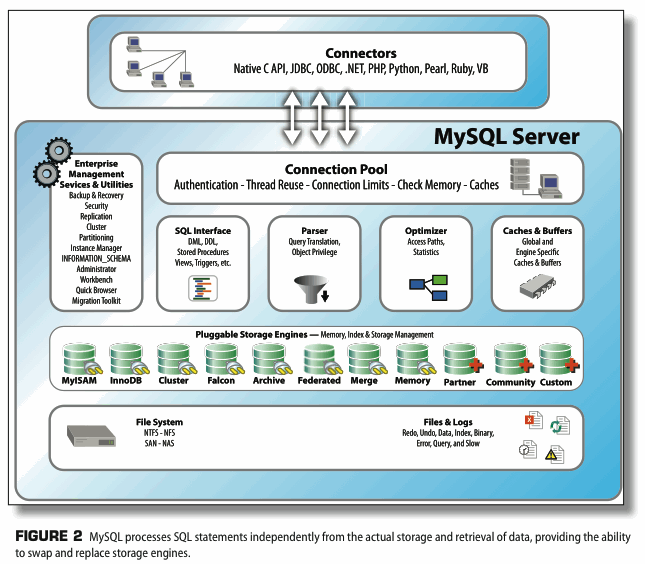

## MySQL server architecture

### SQL Interface

Provides the mechanisms to receive commands and transmit results to the user.

- built to the ANSI SQL standards and accepts the same basic SQL statements as most ANSI-complicant database servers
- connections to the database server are received from the network communication pathways, and a thread is created for each.

### Parser

